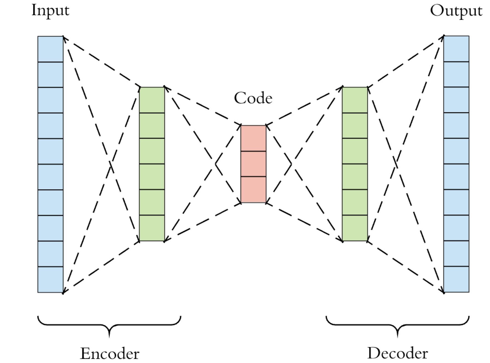
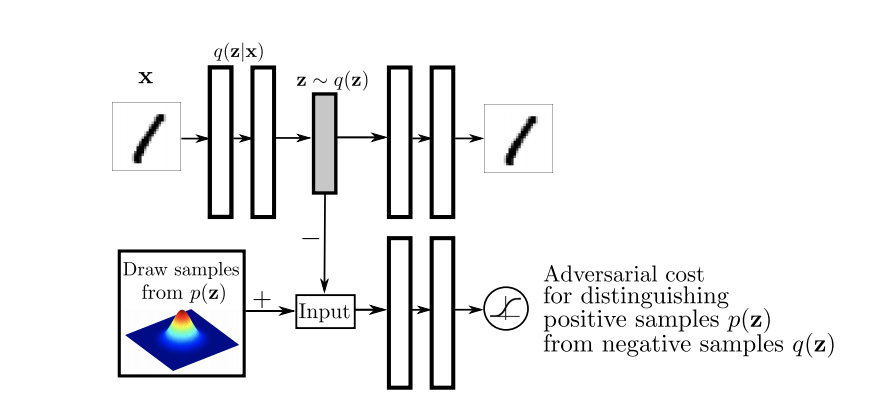
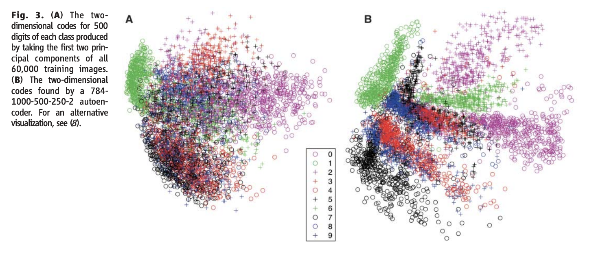
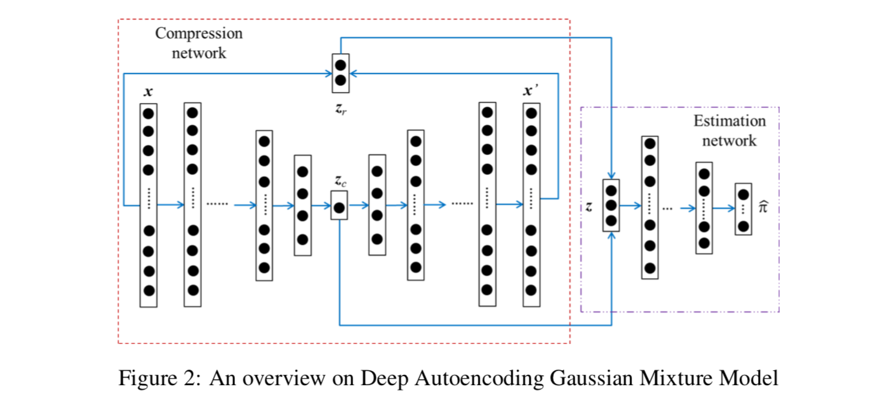

```{r setup, include=FALSE}
knitr::opts_chunk$set(echo = FALSE, fig.pos= "h")
```

# Introduction to autoencoders

An autoencoder is a neural network technique that aims to learn an input and output it back as its output [@Goodfellow-et-al-2016]. To achieve this objective, the autoencoder has 2 components: an **encoder** and a **decoder**. The encoder receives an input $x$ and and converts it to a hidden representation $z$. The decoder receives a representation $z$ and decodes it back to retrieve as much as possible the input $x$. Historically, autoencoders were known as a dimensionnalty reduction method, but it has now more applications by learning latent variables useful in generative modelling and other fields.

## Architecture

As explained in the introduction, autoencoders are divided in two parts: the encoder and the decoder. The encoder compresses the information into a given representation and the decoder decompresses it back to its original format (see figure \@ref(fig:ex1)).

```{r ex1, fig.cap="Autoencoders structure example.", out.width = '60%', fig.align='center', fig.pos=""}

```

The hidden representation (or latent representation) is often smaller because of the structure of the layers between the input and that representation. Autoencoders that have a smaller hidden representation than its inputs are called *undercomplete*. In those cases, the constraints on $z$ force the network to learn the more important features. It could be applied to feedforward networks or to convolutional networks. We are typically interested in that hidden representation, in comparison to the output of the decoder (the reconstructured input) which may sound useless.


## Optimization

Autoencoders intuition is to build back the input $x$ by passing through the 2 components (encoder and decoder). As such, this kind of model does not need any target, so we say it is an unsupervised method. The training of the parameters is mainly done by minimizing the reconstruction error. The loss is given by:

$$
L(x, p_\phi{\{q_\theta(x)\}})
$$

where $q(x, \theta)$ is the encoder and $p(z,\phi)$ is the decoder function. The loss generally includes another component $\Omega(x)$ that acts as a regularizer (we'll see in the next sections). The regularization is often essential to prevent the network to "copy/paste" examples of the training set. Those situations can occur even more when the hidden representation is equal or greater than the inputs (*overcomplete*). The minimization of this loss function is done by gradient descent. For instance, the encoder parameters are gradually updated by:

\begin{equation} \label{optim}
\theta \leftarrow \theta-\epsilon*\frac{\partial L}{\partial\theta}
\end{equation}

where $\epsilon$ is a learning weight that aims to control the size of the learning steps.

## Example

Let's illustrate the high-level concepts presented in the last 2 sections with an overly simplistic example. We have a input $X$ with $p=2$ features and 10 observations. We want to encode those 2 features in one single features using an basic autoencoder with 1 hidden layer. In summary, our autoencoder has 3 layers (input layer, hidden layer and output layer). We also choose a sigmoid activation function for our hidden layer and a linear activation function for our ouput layer (those choices are arbitrary).

```{r ex2, fig.cap="Autoencoders structure example.", out.width = '60%', fig.align='center', fig.pos=""}
knitr::include_graphics("images/example-toy-ae.png")
```

The encoder function (that transforms $x$ to $z$) could be expressed that way:

$$
q_{\theta}(x)=h\big(x_1*w_{1,1} + x_2*w_{1,2} + b_1\big)
$$

where $h(x)$ is a sigmoid function in the form of $h(x)=\frac{1}{1+e^{-x}}$. The parameters $\theta$ that need to be optimized are $w_{1,1}, w_{1,2}$ and $b_1$. We can also use the matrix notation :

$$
q_{\theta}(X)=h\big(X*\boldsymbol w_1 + b_1\big)
$$

In the same fashion, the decoder could be expressed (for the output $\hat{x_i}$) as:

$$
p_{\phi}(z)=f\big(z*w_{2,i} + b_2\big)
$$

where $f(x)$ is a linear function in the form of $f(x)=x$. The parameters $\phi$ that need to be optimized are $w_{2,1}, w_{2,2}$ and $b_2$. We can also use the matrix notation (which is more convinient in that case):

$$
p_{\phi}(Z)=h\big(Z*\boldsymbol w_2 + b_2\big)=\hat{X}
$$

To optimize those parameters $\theta$ and $\phi$, we need to define a loss function (see equation \@ref(perte1)). Let's say we want to minimize the reconstruction error only, we can define our loss as:

\begin{equation} \label{perte1}
\begin{split}
L(x,\hat{x}) & = L\big(x, p_\phi\{q_\theta(x)\}\big) \\
& = \frac{1}{2} \sum_{i=1}^{n} \big(x^{(i)}-p_\phi\{q_\theta(x^{(i)}\}\big)^2 \\
& = \frac{1}{2} \sum_{i=1}^{n} \sum_{j=1}^{p} \big(x_{j}^{(i)}-p_\phi\{q_\theta(x_{j}^{(i)})\}\big)^2
\end{split}
\end{equation}

where $i$ stands for the $i$-th observation.

Once we have a loss function, we can optimize the parameters of the encoder/decoder using the *chain rule* of derivatives for each layer (see equation \@ref(optim)).


# Types of autoencoders

In the previous sections, we introduced the general idea behind the autoencoders. However, there are several types of autoencoders and each has their own strengths in different areas. They differ in their architecture and their optimization process, but at the end, they all consist in unsupervised methods that learn latent structure of the data.

## Origins of autoencoders

The origins of autoencoders were known in the 80s and introduced by Hinton and the PDP Lab in Stanford [@Rumelhart-1986]. In this paper, they essentially tried to learn a hidden representation using the input as the output of the model.

## Deep autoencoders

Once the fundamental idea of autoencoders has been developped, a new generation of autoencoders came up more recently and where multiples hidden layers were stacked and trained bottom up to form what we call "deep autoencoders" [@HintonSalakhutdinov2006b]. In the following years, many variants have been applied to autoencoders, mainly regarding the regularization component, to be able to generalize better and better and learn useful representation and structure behind the data.  

## Sparse autoencoders

One way of learning useful representations using autoencoder is to impose a constraint of **sparsity** in the hidden representation [@ranzato-2007]. A sparse autoencoder is basically an autoencoder that has a sparsity penalty in the loss criterion:

$$
L(x, p_\phi\{q_\theta(x)\}) + \Omega(z)
$$

where $z$ is the hidden representation (or the output of the encoder). That sparsity penalty ($\Omega(z)$) will pull some neurons output values towards zero in the hidden layer, making them "inactive" [@Ng-2011]. That regularization will prevent overfitting and prevent the network to learn by heart every input.

Sparse autoencoders are generally used to learn features for another task (e.g classification). In that sense, it can accomplish the feature engineering of a task by learning useful features.

## Denoising autoencoders

Another kind of autoencoder that has been widely used are the denoising autocoders [@Vincent-2008]. These autoencoders are really close to ["vanilla deep autoencoders"](#deep-autoencoders) except they receive a corrupted input and afterwards are trained to produce an uncorrupted output.

The denoising autoencoders will then minimize:

$$
L(x, p_\phi\{q_\theta(\tilde{x})\}) 
$$
where $\tilde{x}$ is a copy of $x$ that has been corrupted.

There are different ways of corrupting the input. One way could be to choose a given proportion $\nu$ of inputs to randomly "destruct" by assigning a 0-value while keeping the other inputs untouched. That approach is called *masking noise*. We could also corrupt the data by adding *Gaussian noise* or setting randomly a proportion of the inputs to maximum or minimum value (*salt-and-pepper noise)*. The intuition behind this approach is again to prevent the algorithm from learning the useless identity function.

## Contractive autoencoders

The contractive autoencoders [@Rifai-2011] are often associated with the denoising autoencoders. The loss criterion includes a regularizer penalty in the form of:

$$
\Omega = \lambda \Bigg| \Bigg| \frac{\partial q_\theta(x)}{\partial x}\Bigg| \Bigg|^{2}_F{}
$$

where $F$ stands for Frobenius norm (sum of squared elements). In this case, we are adding a penalty corresponding to the Jacobian matrix of the partial derivatives of the encoder function. 

Denoising autoencoders are built to make the reconstruction function resist small but finite-size perturbations of the inputs, while contractive autoencoders make the feature extraction function (the encoder) resist small changes in the inputs.

## Variational autoencoders

The variational autoencoders [@kingma2013autoencoding] have a slightly different approach than other kinds of autoencoders and are particularly useful in generative modelling and reinforcement learning. Again, these autoencoders have a loss criterion in the form of:

$$
L = \text{reconstruction error} + \text{regularizer}
$$

However, instead of encoding a hidden representation of size $n$, it outputs two vectors of size $n$: a vector of means $\boldsymbol \mu$ and a vector of standard deviations $\boldsymbol \sigma$. Those vectors allow to sample from Gaussian distributions, which gives the variational autoencoders the unique property of having a latent space that is **continuous** [@toward-VAE]. This is the main difference with previous seen autoencoders. In other words, the basic autoencoders learn a reprensetation that "points" somewhere in the latent space, while varitional autoencoders learn a representation that points to an "area", an area that is defined by the mean $\boldsymbol \mu$ and the standard deviation $\boldsymbol \sigma$ of the latent space. That property is actually very useful in generative modelling. The figure \@ref(fig:vae) illustrates the basic structure of a variational autoencoder.

```{r vae, fig.cap="Variational autoencoder structure. Instead of learning a representation directly, it learns the parameters of Gaussian distributions and the hidden representation is given by sampling from those distributions.", out.width = '60%', fig.align='center', fig.pos=""}
knitr::include_graphics("images/vae-structure.png")
```

The explicit variational autoencoder loss criterion is given by :

$$
L(x, p_\phi\{q_\theta(x)\}) + D_{KL}\big[q_\theta(z|x) || p_\phi(x|z)\big]
$$

where $D_{KL}$ is a regularizer called the Kullback-Leibler divergence. Its goal is to ensure that the two distributions $p$ and $q$ are somewhat similar.

## Adversarial autoencoders

Adversarial autoencoders [@Makhzani-2015] are really close to the variational autoencoders in the sense that they also produce a continuous latent space by learning a certain distribution. However, this prior distribution is set in advance and learned in an adversarial fashion instead of being learned by a divergence crtierion. That's mainly why we say that adversarial autoencoders are the combination of variational entoencoders and generative adversarial networks (GAN). The figure \@ref(fig:aae) shows the architecture of an adversarial autoencoder. In that figure, the upper portion corresponds to the standard autoencoder that reconstruct the input $x$ from a latent representation $z$. The bottom portion is a second network trained to predict whether a sample arise from the hidden representation or from a distrubution decided in advance. As such, the autoencoder will try to learn the prior distribution and fool the model at the bottom. That kind of approach is often related with generative modeling.

```{r aae, fig.cap="Basic architecture of a adversarial autoencoder.", out.width = '100%', fig.align='center', fig.pos=""}

```

Like other autoencoders, adversarial autoencoders learn an encoding distribution $q_{\theta}(z|x)$. In order to do it, we impose a certain distribution on the hidden representation that we express as $p(z)$. If we express the data distribution as $p_d(x)$, we can express the posterior distribution of $z$ as :

$$
q(z) = \int_{x}q_{\theta}(z|x)p_d(x)dx
$$

In the training process, the adversarial autoencoder is trying to match the $q(z)$ and the $p(z)$ distributions. There are several choices for the prior distribution from which to learn:

- Gaussian distribution
- Gamma distribution
- etc

Adversarial autoencoders are generative models that could be used to generate new data, or also to do semi-supervised learning or clustering.

# Applications of autoencoders

This section aims to survey the different known applications of autoencoders in the litterature and across different industries.

## Dimensionality reduction

One of the first applications for which the autoencoders were used was associated with **dimensionality reduction**. For example, [@HintonSalakhutdinov2006b] showed that a deep autoencoder could learn to represent data in a smaller representation better than the widely used PCA method (see figure \@ref(fig:pca)).

```{r pca, fig.cap="Comparison between the learned representation of a PCA and a deep autoencoder.", out.width = '100%', fig.align='center', fig.pos=""}

```

## Information retrieval

Another application of autoencoders is related with **information retrieval**. This is the task of finding an entry similar to another entry in a database. It can be done by dimensionnality reduction, and even binarization of an input, which is called semantic hashing. This has been applied to both text [@Salakhutdinov-2009] and images [@Weiss2008SpectralH].

## Anomaly detection

A task that is often related with unsupervised methods is the idea of finding outliers or anomalies in a dataset. In fact, that's normally an information we don't have and that we can't train on it. Thus, we generally need unsupervised ways of discovering those anomalies.

For instance, [@zhou-2017] used denoising autoencoders to build an unsupervised anomaly detection algorithm. They applied their methodology, that includes an anomaly regularizing penalty, on MNIST dataset to find anomalies in hand written digits.

Another interesting example of anomaly detection using autoencoders was made by [@zong2018deep]. They used autoencoders to build a small representation and use that representation as well as the reconstruction error to train a Gaussian Mixture Model (GMM). The figure \@ref(fig:DAGMM) shows the overview of the compression (deep autoencoder) and estimation (GMM) tasks.

```{r DAGMM, fig.cap="Overview of the Deep Autoencoder and Gaussian Mixture Model.", out.width = '100%', fig.align='center', fig.pos=""}

```

Autoencoders and density estimation are often used togheter in anomaly detection problems. It is the case in one-class learning problem such as [@Cao-2016]. Their work showed that it's possible to use the power of autoencoders to learn a small compact representation and then use density estimation techniques such as Centroid or KDD that work best in low-dimensionnal situations.

## Clustering

A well known task in the unsupervised world is the task of clustering. [@DilokthanakulMG16] used varitional autoencoders and introduced a Gaussian Mixture Model (GMM) as a prior distribution with the goal of performing clustering.

[@Xie-2016] also proposed a deep embedding approach that simultaneously learns feature reprensentations and cluster assignements. [@Xi-2018] also used autoencoders to make clustering on a complex space where the non-linearity of neural networks allowed them to learn complex subspaces.

Multivariate density estimation is widely performed for fundamental unsupervised tasks such a clustering. [@ijcai2018-374] used variational autoencoders and applied a Student-$t$ distribution instead of a Gaussian distribution for the decoder.

\newpage

# References
