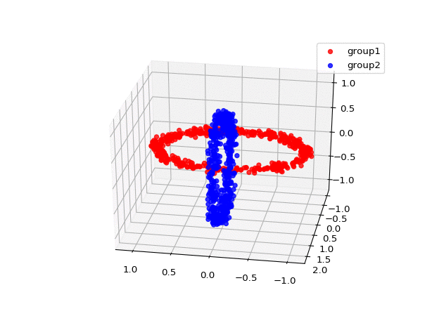

```{r setup, include=FALSE}
knitr::opts_chunk$set(echo = TRUE, eval = FALSE)
```

# Introduction

In this short article, I wanted to get familiar with the application of autoencoders in a clustering context. This will probably be the main subject of my thesis. I also wanted to design an architecture and train a first autoencoder so that I get in touch with the basic concepts behind autoencoders, the well-known libraries to implement such architectures and then build on it in the future months.

# Dataset

Like I mentioned, the purpose of this article is to *get into it*. As such, I selected a (simple) synthetic dataset that has been widely used in different unsupervised experiments. This dataset, called `chainlink`, will allow us to benchmark some preliminary experiments. This 3 dimensional dataset is available from that [link](https://github.com/deric/clustering-benchmark/blob/master/src/main/resources/datasets/artificial/chainlink.arff). Let's first import our dataset:

```{python}
import pandas
dt = pandas.read_csv('src/chainlink/chainlink.csv')

X = numpy.array(dt[["x", "y", "z"]])
```

The animation below illustrates that dataset (along with the 2 different groups) in a 3D plan:


The main challenge (task) with this dataset is that it is linearly not separable. As such, some traditional clustering methods will struggle identifying the 2 different groups. In the next sections, we will try to evaluate that by applying some traditional clustering methods and also have a first glimpse on how autoencoders could be involved in a clustering task.

# Traditionnal clustering methods

In this section, I will try different traditional clustering method to the `chainlink` dataset and see which methods are able to retrieve the 2 different groups.

## $k$-means

One well-known and used clustering method is indeed the $k$-means. Given an initial set of $k$ centroids, this method uses an iterative process where it assigns each observation to its closest centroid and then recomputes those centroids.

I used `sklearn` library to train a $k$-means model:

```{python}
from sklearn.cluster import KMeans

kmeans = KMeans(n_clusters = 2, random_state=0).fit(X)
```

Here is the result of the trained model with 2 preselected groups and the default implementation parameters. We can see that this method is not able to separate the 2 groups.


## Hierarchical clustering

Another well known clustering method is the hierarchical clustering. This method builds a hierarchy of clusters by sequentially joining observations and groups of observations together. Those groupings could be either ascending (bottom-up) or descending (top-down). The method that selects which observations or which group to join is called the linkage method (there is multiple linkage methods).

I trained an ascending hierarchical model with 2 groups and "Ward" linkage:

```{python}
from sklearn.cluster import AgglomerativeClustering

hclust_ward = AgglomerativeClustering(n_clusters=2, linkage="ward").fit(X)
```

Again, the model is not able to properly separate the data. However, we see a different output this time.


The "Ward" linkage method builds groups that minimize the variance in the clusters created. It tends to create more compact clusters. It is a feature we generally want from clustering, that's why this linkage method is interesting in many applications. However, it does not fill our needs for the `chainlink` clustering task. At opposite, the "single" linkage method uses minimal distance between observations of 2 groups to merge clusters together. It's often characterized by the *chianing effect*, where a chain of points could be merged together without taking into account the overall shape of the emerging cluster [@Manning:2008:IIR:1394399]. This local property could be useful in this case. As such, I trained a hierarchical model with single linkage method:

```{python}
hclust_single = AgglomerativeClustering(n_clusters=2, linkage="single").fit(X)
```

We can see that the chaining effect did help us in this case:



## Spectral clustering

Finally, I tried another traditional clustering algorithm: spectral clustering. This method first tries to reduce the dimensionality of data with eigenvalues and then perform clustering in those smaller dimensions. Since the data is only 3 dimensions, we can think the dimensionality reduction might not be very useful in this case.

Again, we trained this model with default `sklearn` parameters:

```{python}
from sklearn.cluster import SpectralClustering

spectral = SpectralClustering(n_clusters=2).fit(X)
```

From the figure below, we can see that the spectral clustering is not able to separate correctly the 2 groups.


# Clustering with autoencoders

Now that we have tried different traditional approaches to the `chainlink` dataset, we can now try another unsupervised approach: an autoencoder. In this first attempt to train an autoencoder for a clustering task, I kept the approach as simple as possible. As such, here is the summary of my experiment:

1. Train an autoencoder and generates an hidden representation in higher dimensions than the 3 dimensional inputs.
2. Perform a singular value decomposition (SVD) of the hidden representation to retrieve a low dimensions vector for each input.
3. Apply a traditional clustering method on this reduced inputs space.

We chose the autoencoder architecture based on this paper [@affeldt2019]. The encoder architecture consists of 3 hidden layers of size 50, 75 and 100. The decoder is the mirror in terms of layers: 75, 50 and a layer of size 3 as the output (same size as the input). All layers have rectified linear unit (ReLU) activation functions except for the output layer, that has a sigmoid. Here is the detailed architecture of the autoencoder:

```{python}
import torch
import torch.nn as nn
import torch.nn.functional as F

class SimpleAE(nn.Module):

    def __init__(self):
        super(SimpleAE, self).__init__()

        self.encoder = nn.Sequential(
            nn.Linear(3, 50),
            nn.ReLU(),
            nn.Linear(50, 75),
            nn.ReLU(),
            nn.Linear(75, 100)
        )

        self.decoder = nn.Sequential(
            nn.Linear(100, 75),
            nn.ReLU(),
            nn.Linear(75, 50),
            nn.ReLU(),
            nn.Linear(50, 3),
            nn.Sigmoid()
        )

    def forward(self, x):
        encoded = self.encoder(x)
        decoded = self.decoder(encoded)
        return encoded, decoded
```

For the training process, I used an Adam optimizer, a mean square error loss and those training configurations:

```{python}
BATCH_SIZE = 32
LEARNING_WEIGHT = 0.001
NUM_EPOCHS = 25
```

After the autoencoder has being trained, we retrieved for each input, the **embeddings** of length 100. I then performed a SVD decomposition of this 100 dimensions matrix to retrieve a 3 dimensional space. Finally, I applied a **spectral clustering** with 2 clusters.

```{python}
from sklearn.decomposition import TruncatedSVD
from sklearn.cluster import SpectralClustering

embeddings = predict(SimpleAE, X).detach().numpy()
svd_embeddings = TruncatedSVD(3).fit_transform(embeddings)
svd_spectral = SpectralClustering(n_clusters=2).fit(svd_embeddings)
```

We can see from the figure below that the clustering method is able to separate the two groups in the 3 dimensional space. It means that the autoencoder has been able to generate a linear separable 3D space. This is mainly possible by the activation functions applied to each layer that allows the learning of nonlinearities.


# Conclusion

In this short article, I wanted to get familiar with neural networks libraries, particularly for autoencoder architectures. Even if the architecture was simple, same for the training procedure, I can say that this objective is done. Furthermore, I wanted to apply this autoencoder in a clustering context and also compare with more traditional approaches. Without too much work, I managed to build a model that performs better than few traditional approaches. That makes me think autoencoders have interesting properties regarding the learning of nonlinearities and maybe in learning high dimensional space (which I have not tried yet).

# References