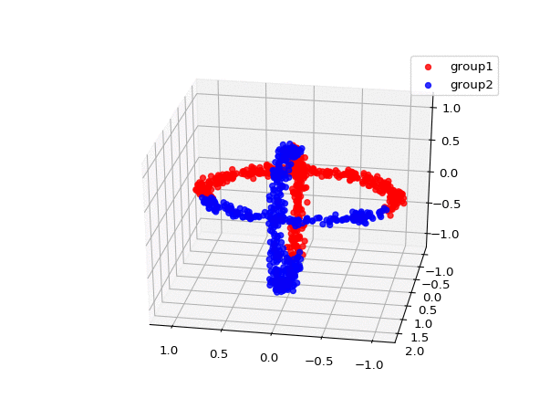
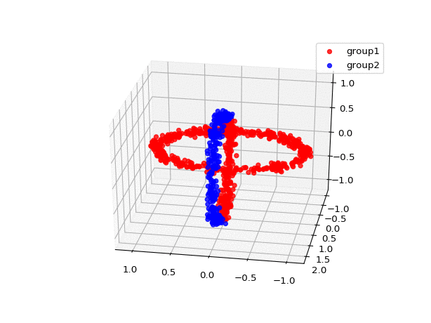
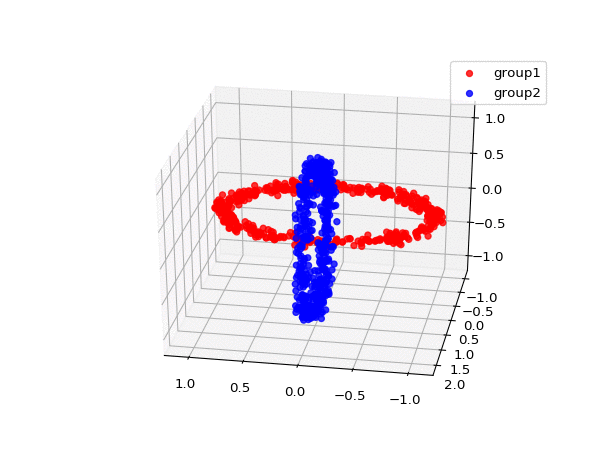

```{r setup, include=FALSE}
knitr::opts_chunk$set(echo = TRUE, eval = FALSE)
```

In this short article, I wanted to get familiar with some libraries I might need to use in my thesis project. I also wanted to design an architecture and train a first autoencoder so that I get in touch with the basic concepts and build on it.

# Introduction

Like I mentionned, the objective of this article is to *getting started*. As such, I selected a synthetic dataset that has been widely used in different unsupervised experiments. This dataset, called `chainlink`, will allow us to benchmark some preliminary experiments. This 3 dimensionnal dataset is available from that [link](https://github.com/deric/clustering-benchmark/blob/master/src/main/resources/datasets/artificial/chainlink.arff). Let's first import our dataset:

```{python}
import pandas
dt = pandas.read_csv('src/chainlink/chainlink.csv')
```

The animation below illustrates that dataset (along with the 2 different groups) is a 3D plan:


The main challenge with this task is that it is linearly not separable. As such, some traditionnal clustering methods with struggle identifying the 2 different groups. In the next sections, we will apply some traditionnal clustering methods and also have a first glimspe on how autoencoders could be involved in clustering tasks.

# Traditionnal clustering methods

One well known and used clustering method is indeed the $k$-means. Given an initial set of $k$ centroids, this method uses an iterative process where it assigns each observation to its closest centroid and then recompute those centroids.

Here is the 







# Clustering using AE

